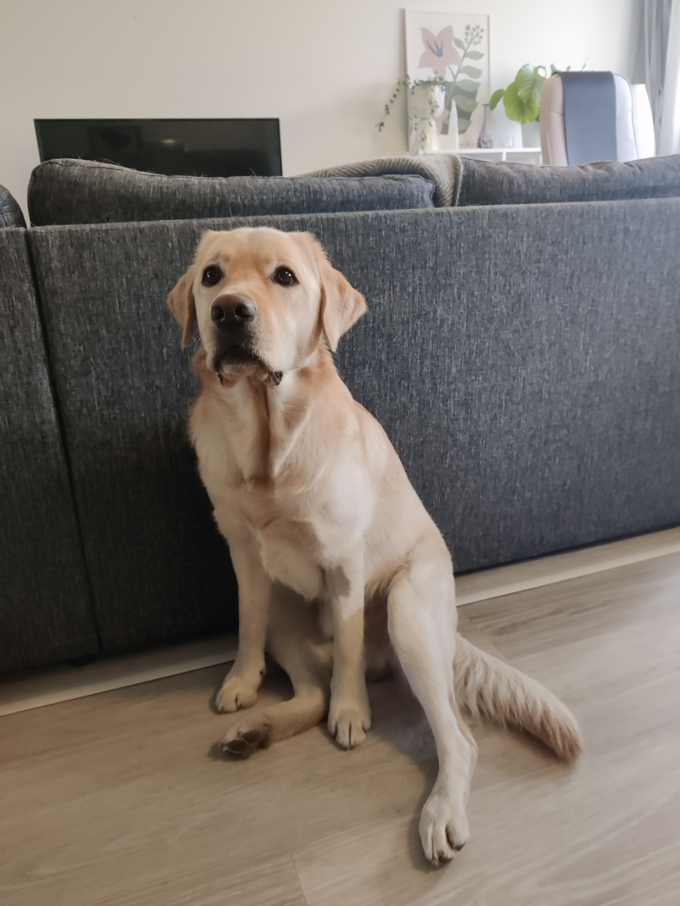

# Dog Breed Identification built with Fast.ai's CNN using transfer learning
---
## Description

This notebook will take on a dog breed identification challenge by [Kaggle](https://www.kaggle.com/competitions/dog-breed-identification). The challenge uses the [Stanford Dogs Dataset](http://vision.stanford.edu/aditya86/ImageNetDogs/), which is a subset of the much larger ImageNet dataset. This notebook also serves as a technical guide, or specification for developing a dog breed identification model using Fast.ai's CNN with transfer learning.

This notebook additionally explores the concepts of exploratory data analysis (EDA), data augmentation, image pre-processing, comprehensive logging of training statistics, the usage of libraries such as pandas, numpy and matplotlib among others.

This project also serves as the technical foundation for my bachelor's thesis on dog breed identification. The aim of this notebook, as well as my thesis, is to evaluate the efficiency and accuracy of my model when compared to similar models trained on the Standford Dogs Dataset.

This notebook is quite extensively documented, and uses various comments, and text cells to explain the development process. The combination of this notebook, and my thesis creates a unified "guide" to doing image classification using Fast.ai. Feel free to comment, critique, and create your own version of this notebook.

---
## Goals

The goal of an image classification problem is to minimize the loss. Loss refers to the measure of how well a model's predictions match the actual classes/labels of the training data. A lower loss value indicates that the model is more accurate at making predictions.

Striving for a high level of accuracy is also key. Accuracy is measured by how well the trained model can correctly predict the classes of unseen new images.

---
## Structure

This is a broad overview of the main table of contents of this notebook:
1.   Installs, Imports & Settings
2.   Load the dataset
3.   EDA
4.   Dataloader
5.   Training
6.   Logging
7.   Post-Training Analysis
8.   Predictions
9.   Exports
10.  Import trained model
---
## Technical Specifications

This notebook will automatically download the Stanford dataset from my personal Google Drive, via a public link. But if you prefer you can [download](https://www.kaggle.com/competitions/dog-breed-identification/data) the dataset as a `.zip` file from Kaggle (you need a free Kaggle account to be able to download the file). If you do download the `.zip` file yourself, be sure to unzip the file in the repo's root dir., and rename the file: `stanford-dogs-dataset`

This project employs Python and the [Fast.ai](https://github.com/fastai/fastai) library to create an image classification model that leverages transfer learning and a convolutional neural network (CNN) to accurately and efficiently identify dog breeds trained on the Stanford Dogs dataset.

Begin by downloading or cloning this projects public repo [GitHub](https://github.com/krullmizter/dog-breed-id-fastai).

### Local Development (Anaconda)

If you run this notebook locally, I recommend using Jupyter Notebook like [Anaconda notebooks](https://anaconda.org/), creating a new environment, and running Anaconda with administrative privileges.

You can download and use the base env. files: `environment.yaml`, `requirements.txt` for conda, and Python respectively. The files can be found in the [repo](https://github.com/krullmizter/dog-breed-id-fastai/tree/main/venv).

Create a conda env. from the terminal:
`conda env create -f environment.yaml`, or import the `environment.yaml` file into your Anaconda navigator.

Install all the base Python packages with pip:
`pip install -r requirements.txt`

#### Errors
`PackagesNotFoundError`

If your conda installation can't find a certain package to download, then a tip is to use the dependency name, and the `-c` flag to specify from what channel you wish to download the dependency from:

`conda install fastai pytorch pytorch-cuda -c fastai -c pytorch -c nvidia`

### Google Colab

If you want an easy way to run this notebook, use cloud-hosted GPUs, and have an easy time with dependencies and packages, then I recommend [Google Colab](https://colab.research.google.com/). To get started upload the `main.ipynb` to Colab.

### Training Stats

When running this notebook, a directory called `training` will be created, in the root folder. It will hold a `.json` file with the stats of the model's training since its first successful training run. This way, one can view the past training stats to help with tweaking the model further. The directory will also hold the exported trained model as a `.pkl` file.

### Development

My training was computed locally on an RTX-3070 GPU.

The main software and libraries I used (specified versions are not required):
* Anaconda (1.11.1)
    * Conda (23.3.1)
* Python (3.10.9)
    * pip (22.3.1)
* PyTorch (2.0.0)
    * PyTorch CUDA (11.7)
* Fast.ai (2.7.12)

---
## TODO
* View bounding boxes.
* Hover effect over the second scatter plot.
* Link to thesis when done.
---

## Copyright 

Copyright (C) 2023 Samuel Granvik

This program is free software: you can redistribute it and/or modify
it under the terms of the GNU General Public License as published by
the Free Software Foundation, either version 3 of the License, or
(at your option) any later version.

This program is distributed in the hope that it will be useful,
but WITHOUT ANY WARRANTY; without even the implied warranty of
MERCHANTABILITY or FITNESS FOR A PARTICULAR PURPOSE.  See the
GNU General Public License for more details.

You should have received a copy of the GNU General Public License
along with this program.  If not, see <http://www.gnu.org/licenses/>.

---
This code was created by Samuel Granvik. If you use or modify this code, please give attribution to Samuel Granvik. 

Links: [Email](samgran@outlook.com) | [GitHub](https://github.com/krullmizter/) | [LinkedIn](https://www.linkedin.com/in/samuel-granvik-93977013a/)

---

My dog Laban ❤️

